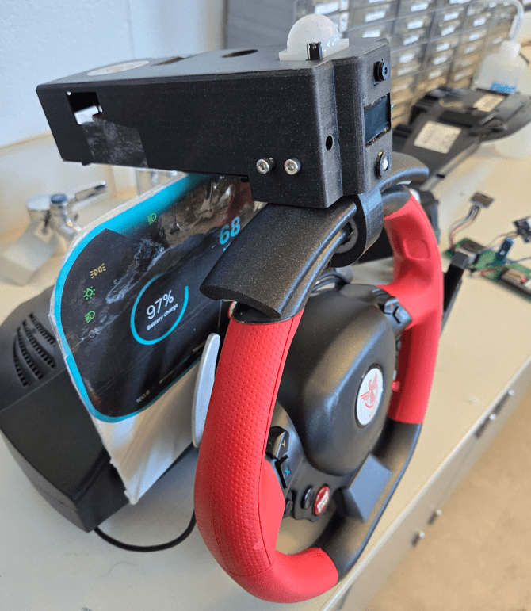
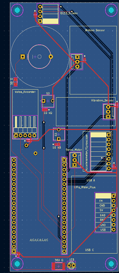
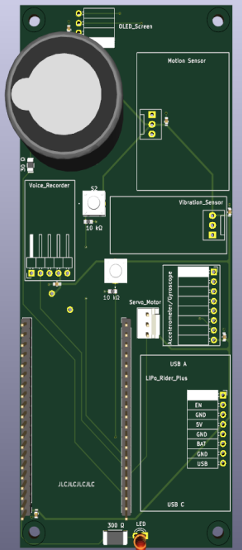
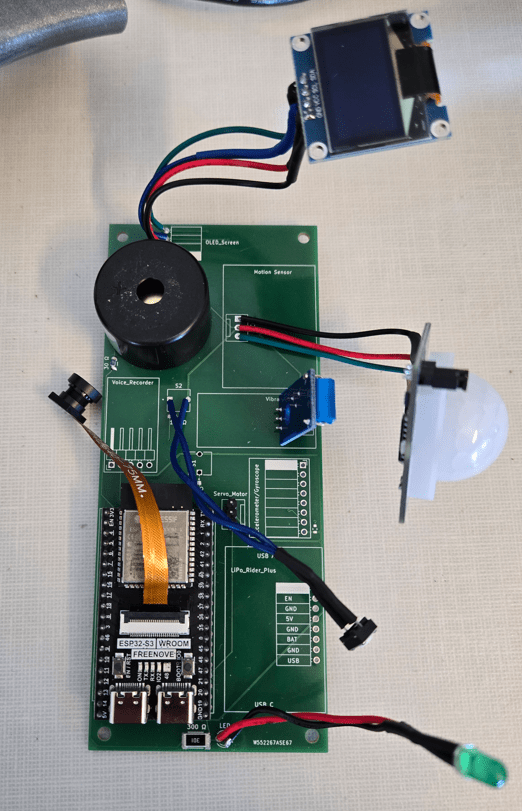
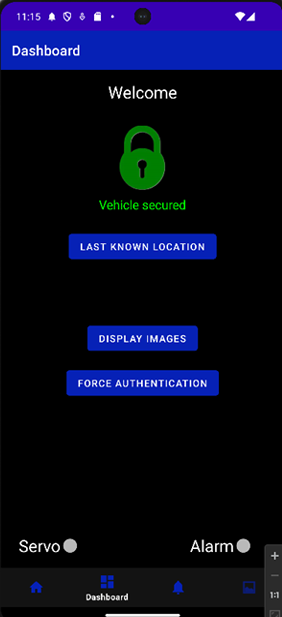
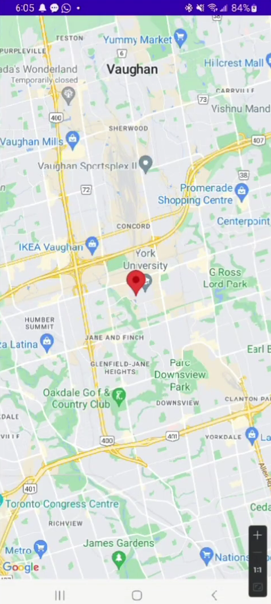

# Smart vehicle steering wheel lock system to prevent theft and DUIs

  
   
  Device demo on steering wheel/dash

This Fourth-Year Capstone project at York University involved developing an innovative vehicle security system combining hardware design, embedded systems, and cloud computing. The core hardware component featured a custom PCB integrating an ESP32 microcontroller with GPS module and various sensors for comprehensive vehicle monitoring.

  
   
  System architecture broad overview

<table>
  <tr>
    <td>
    
PCB layer 1
</td>
    <td>
    
PCB layer 2
</td>
    <td>
    
PCB with external sensors
</td>
  </tr>
</table>

The embedded firmware was programmed in C++ to handle multiple tasks: sensor data collection, wireless communication, GPS tracking, and real-time data transmission. A key innovation was the cloud-based facial recognition system for driver authentication, developed using Python and Flask, containerized for deployment on Google Cloud Platform. The facial recognition service processes real-time video streams and maintains user authentication states. The system architecture implements Firebase real-time database enabling reliable communication between the microcontroller, cloud services, and mobile application.

  
   
  Cloud Structure broad overview

The user interface features a custom Android application developed in Java, providing real-time monitoring capabilities, system control features, and secure user authentication.

<table>
  <tr>
    <td>
    
Android App Dashboard
</td>
    <td>
    
App GPS location view
</td>
  </tr>
</table>

The entire system works cohesively through Firebase integration, creating a robust security solution that effectively prevents unauthorized vehicle access while maintaining user convenience and system reliability.

### Technologies: C++, Python, Java, Flask, Firebase, GCP, Android Studio, PCB Design, GPS
